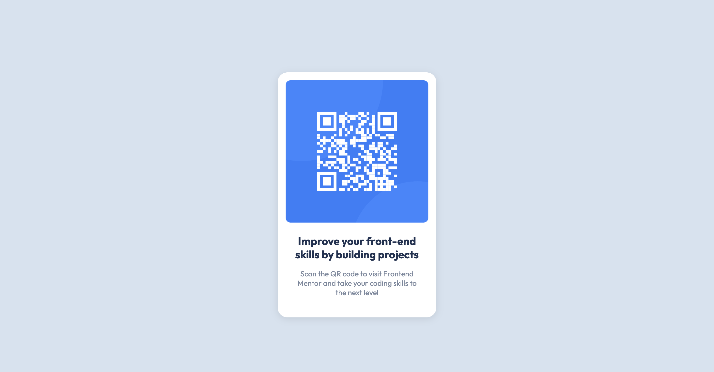

# Frontend Mentor - QR code component solution [NEWBIE]

This is a solution to the [QR code component challenge on Frontend Mentor](https://www.frontendmentor.io/challenges/qr-code-component-iux_sIO_H). Frontend Mentor challenges help you improve your coding skills by building realistic projects. 

## Table of contents

- [Overview](#overview)
  - [Screenshot](#screenshot)
  - [Links](#links)
- [My process](#my-process)
  - [Built with](#built-with)
- [Author](#author)

## Overview

### Screenshot

### Links

- Solution URL: [Frontend Mentor](https://www.frontendmentor.io/solutions/qr-code-component-cc6_k3s0n5)
- Live Site URL: [Github Pages](https://sophie-mc-dev.github.io/qr-code-component/)

## My process

### Built with

- HTML5
- SCSS 

## Author

- LinkedIn - [Sofia Merino Costa](https://www.linkedin.com/in/sofia-m-costa/)
- Frontend Mentor - [@agirlhasnoname07](https://www.frontendmentor.io/profile/agirlhasnoname07)

